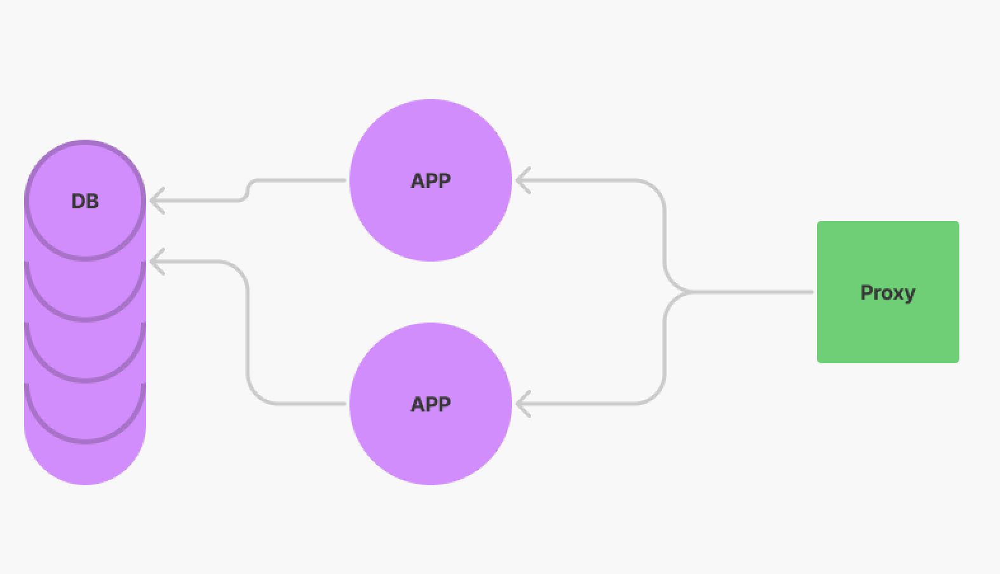
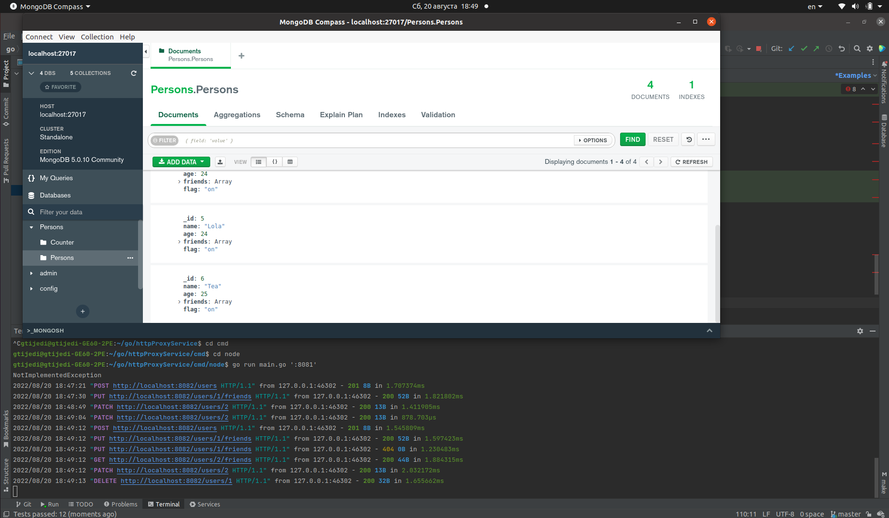

# http service управления БД пользовтаелей в MongoDB c reverse-proxy.

Сервис предназначен для создания,хранения и изменения базы пользователей в MongoDB путем http запросов.

В сервисе реализовано:
- Поднятие двух реплик приложения
- Запуск реверсивной прокси для получения ей запросов извне и передаче их репликам приложения.
- Запись,изменение и удаление данных о пользователях в MongoDB.
- Есть возможность создания пользователя,создание дружбы между пользователями,изменение возраста и поулчения списка друзей пользовтеля,
так же пользовтеля можно удалить.

### Требования
Установите компилятор `Go` (если еще не установлен): https://golang.org/doc/tutorial/getting-started
Необходим доступ к рабочей MongoDB: https://docs.mongodb.com/manual/

### Установка
Склонируйте репозиторий ,запустить сервис можно будет через makefile.
Изначальные настройки сервиса:
1-ая реплика слушает по адресу "http://localhost:8080"
2-ая реплика слушает по адресу "http://localhost:8081"
прокси слушает по адресу "http://localhost:8082".

### Взаимодействие с сервисом
- Для запуска сервиса воспользуйтесь командой :
>make run -j3
- В сервисе реализован обработчик создания пользователя. У пользователя должны быть следующие поля: имя, возраст и
  массив друзей. Пример запроса :

>POST http://localhost:8082/users HTTP/1.1
content-type: application/json

>{"name":"name","age":age,"friends":[]}

Данный запрос должен возвращать id и статус 201.

- В сервисе реализован обработчик , который делает друзей из двух пользователей. Например, если мы создали двух
пользователей и нам вернулись их ID, то в запросе мы можем указать ID пользователя, который инициировал запрос на
дружбу, и ID пользователя, который примет инициатора в друзья. Пример запроса:

>PUT  http://localhost:8082/users/1/friends HTTP/1.1
content-type: application/json

>{"target_id": 2}

Данный запрос должен возвращать статус 200 и сообщение «username_1 и username_2 теперь друзья».

- В сервисе реализован обработчик ,который удаляет пользователя. Данный обработчик принимает ID пользователя и
удаляет его из хранилища, а также стирает его из массива friends у всех его друзей. Пример запроса:

>DELETE http://localhost:8082/users/1 HTTP/1.1
content-type: application/json

Данный запрос должен возвращать 200 и имя удалённого пользователя с id = 1.

- В сервисе реализован обработчик, который возвращает всех друзей пользователя. Пример запроса:

>GET  http://localhost:8082/users/1/friends HTTP/1.1
content-type: application/json

Данный запрос должен возвращать 200 и имя друзей пользователя с id = 1.

- В сервисе реализован обработчик, который обновляет возраст пользователя. Пример запроса:

>PATCH http://localhost:8082/users/1 HTTP/1.1
content-type: application/json

>{"age": 33}

Запрос должен возвращать 200 и сообщение «возраст «пользователя» успешно обновлён».

### Завершение работы с сервисом
- Для завершения работы нажмите `Ctrl+C` в его консоли (graceful shutdown).

### Пример работы сервиса:
